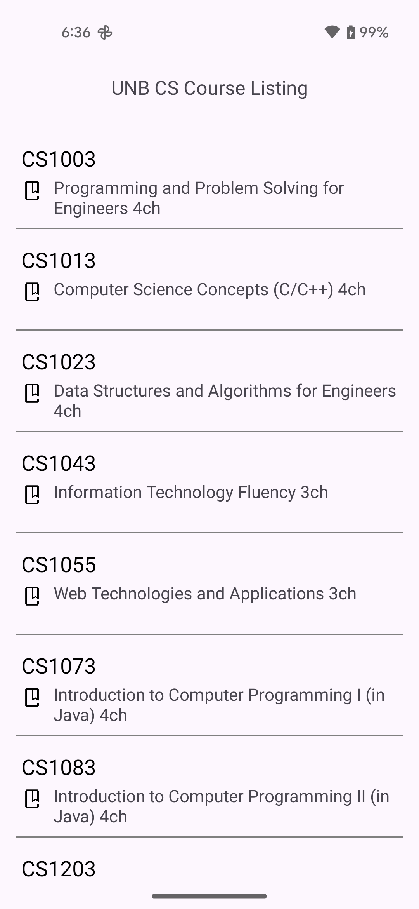
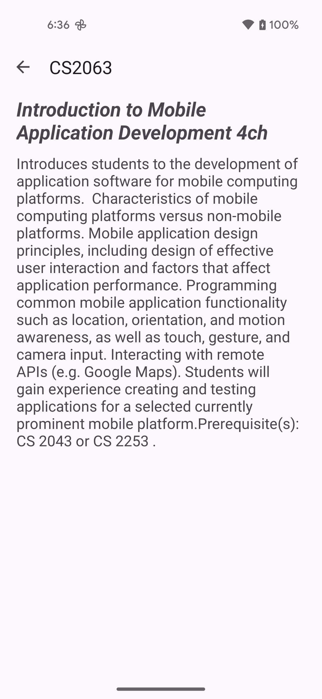

# Lab 5 - Coroutines and Scrolling Lists

In class we have seen the importance of moving long-running operations off of the UI thread and into a worker thread. In this lab you will implement (portions of) this functionality using a separate thread to preserve the responsivness of the app.

## Introduction

Many mobile applications need to display a scrollable list of items where the user can select an item to take some action specific to it.  There are two common ways to display a scrolling list of items in Android.
1. [`ListView`](https://developer.android.com/guide/topics/ui/layout/listview.html)
2. [`RecyclerView`](https://developer.android.com/guide/topics/ui/layout/recyclerview.html)

The `RecyclerView` provides greater flexibility and will be the focus today.  In this lab you will build an app that displays a scrolling a list of of UNB CS courses including course numbers, titles and credit hours.

Selecting a course from the list of courses in the main activity takes the user to a detail activity showing the description for the selected course. (Yes, the course information we're using in this lab is a bit out of date).

In order to populate the list you will also need to read the details from a local JSON file.  We will do this through the use of [Kotlin Coroutines](https://developer.android.com/kotlin/coroutines) so the main UI thread is not blocked. 

The app will make use of the contents included in an included asset file which contains information about Computer Science courses available at UNB.  This file mimics a simple API response, however, for the purposes of this lab we will build the solution in a way which allows for the data source to be swapped at a later time. 

## Understanding the Skeleton Code

To help you get started there is a skeleton project in place which has the following source files available for you to use.

* `models/Course.kt`
  * Data class representing an individual course

* `utils/JsonUtils.kt`
  * Class containing the code used to read JSON files
  * The class processes the contents of `assets/CS.json` to create `Course` items
    * Note in particular the constructor, you will need to provide a `Context` object when instantiating 

* `utils/LoadDataTask.kt`
  * Class containing the code used to perform data loading in a separate thread

* `Constants.kt`
  * Object class containing the key names for the Intent extra values used between activities

* `DetailActivity.kt`
  * Class to display information about a specific course
      * It doesn't do much yet as you will be completing it during the lab

* `MainActivity.kt`
  * Main activity class used to presents the scrolling list of courses using a `RecyclerView`
    * For this lab we will be using a circular progress bar which is still updated the same way as the progress bars we saw in class
    * Those example projects are good reference throughout the lab

* `MyAdapter.kt` 
  * Class corresponding to the RecyclerView class being used to populate the view with course information.
    * This class also contains an inner class called `MyAdapter` represents the custom adaptor class used by the RecyclerView which extends `RecyclerView.Adapter`
        * The `RecyclerView.Adapter` class provides a layer of abstraction between the `RecyclerView`'s `LayoutManager` and the underlying data that is being displayed which in this case a list of `Course` objects
        * `MyAdapter` itself contains an inner class `ViewHolder` which represents an individual item to display in the scrolling list
          * `onCreateViewHolder` creates `ViewHolder` objects by inflating the corresponding XML layout resource file; it's already implemented for you
          * `onBindViewHolder` will be called when a particular item in the dataset needs to be displayed in the scrolling list, i.e., the user has scrolled and a new item comes into view
          * This method sets up the `ViewHolder` to display the corresponding item in the dataset
      * When the name of a course is clicked the `DetailActivity` will be launched via an explicit `Intent`

Also note of the layout files  
* `activity_detail.xml` and `activity_main.xml` are layouts for `DetailActivity` and `MainActivity` respectively
  * `activity_main.xml` includes a `RecyclerView` where it's `LayoutManager` has been set to a `LinearLayoutManager` to give a list of items
    * This differs from a `GridLayoutManager` which would present the items in a grid
* `item_layout.xml` is used by the `RecyclerView` to display each item in the scrolling list

## Implementation

**Task 2**

Complete the TODOs in the `JsonUtils`, `LoadDataTask`, `DetailActivity`, `MainActivity`, and `MyAdapter` files.

**Task 3**

On a smaller device (or for a very long course description) all of the text won't fit on the screen so we need to be able to scroll the text. You will also notice that there is no vertical scroll bar when the content is too long.

1. Update one of the course descriptions in the CS.json file to ensure that it is long enough to scroll.
2. Update the `description TextView` component defined in the `activity_detail.xml` file to include a scrollbar.

**Writeup Task**

Create a document with the following items:
	* A screenshot of the main activity recycler view
  * A screenshot of the details activity
	* A screenshot of the scrollbar added in Task 3

**Lab Completion**

* LABS COMPLETED IN CLASS: 
  * Show the working app running on an emulator to the instructor or TA for signoff.
  * No files need to be submitted.
* LABS COMPLETED OUTSIDE OF CLASS: 
  * Submit `MainActivity.kt`, `DetailActivity.kt`, `JsonUtils.kt`, `LoadDataTask.kt`, `MyAdapter.kt`, and your answers to the writeup task to the Lab5 drop box folder on D2L 

* Keep a copy of your project work and answers for future reference
