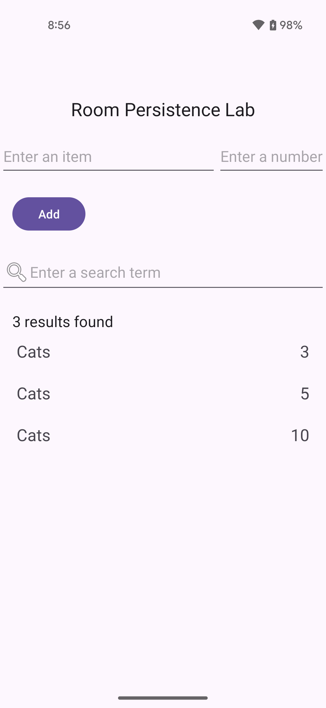

# Lab 6 - Room Persistence Library and MVVM

In lecture we have explored different storage mechanisms available for app specific data.  One of the more used alternatives is to make use of a [SQLite database](https://www.sqlite.org/) which allows for more complex structured data to be stored.  We also took a look at the Room Persistence Library which acts as an Object Relational Model (ORM) abstraction layer overtop of SQLite.  An ORM allows you to use data objects directly which map to tables allowing for them to be used liek any other object.

In addition to providing the abstraction layer over the database the library integrates well with some of the newer constructs being introduced in the Android ecosystem; namely Coroutines for threading and MutableLiveData for onservabilty.  By structuring the project in a Model-ViewModel-Model (MVVM) pattern we start to see how the different layers interact from top to bottom.

In this lab you will build a simple app that uses a SQLite database and Room for managing the data.


## App Functionality

Once completed the user will be able to use the app for the following:
* Add new rows to the database
* Search for rows that have a particular item
  * Below is a sample screenshot of the app after the user has searched for the item "Cats".

    

  * In this case the database had three rows with the item "Cats" with the numbers "3", "5", and "10". (Note that the results have been sorted by number in descending order.)

  * In the case that a search item does not match any rows in the database, a message indicating this is displayed, as shown below.

    


## Resources

For this lab we will go deeper into the use of Coroutines to read and write records in the database.  The data used by the UI will be managed inside a ViewModel using LiveData and observing any changes.  The following documentation will be helpful in this lab.

* [Android Room Persistence Library](https://developer.android.com/training/data-storage/room)
* [Accessing Data using Room](https://developer.android.com/training/data-storage/room/accessing-data)
* [View Model Overview](https://developer.android.com/topic/libraries/architecture/viewmodel)
* [MutableLiveData](https://developer.android.com/reference/androidx/lifecycle/MutableLiveData)

Another good reference will be the [Room Persistence Library example](https://github.com/hpowell-UNB/cs2063-fall-2025-examples/tree/master/data-storage/RoomPersistenceLibraryDemo) from class.


## Understanding the Skeleton Code

To help you get started there is a skeleton project in place which has the following source files available for you to use.


* Start by having a look in the app/build.gradle file
  * There you will notice the following dependency imports which enable us to use the Room Persistence framework and work with ViewModels
  ```kotlin
    // Room Components
    implementation(libs.androidx.room.runtime)
    ksp(libs.androidx.room.compiler)

    // ViewModel Components
    implementation(libs.androidx.lifecycle.viewmodel.ktx)
    ksp(libs.androidx.lifecycle.compiler)
  ```
    * NOTE: ksp refers to Kotlin Symbol Processing which helps process Room annotations

* You are provided the following classes for use:
  * `dao/ItemDao.kt`
    * Interface class which contains the methods for accessing the database
    * The __@Dao__ annotation identifies it as a DAO class for Room
    * This class will need to be updated to include the appropriate queries

  * `db/AppDatabase.kt`
    * Database holder class; main access point to the data
    * This class must be defined as abstract and extend RoomDatabase
    * You annotate the class to be a Room database with @Database and use the annotation parameters to declare the entities that belong in the database and set the version number
      * Each entity corresponds to a table that will be created in the database
    * A Singleton object is being created to prevent multiple instances of the database being opened at the same time
  
  * `entities/Item.kt`
    * Data class defined as an @Entity class which represents a SQLite table

  * `repositories/ItemRepository.kt`
    * Class used to manages queries and enables the use of multiple backends
      * In our case it is used to provide a clean API for data access for the rest of the app

  * `ui/ItemsAdapter.kt`
    * This class translates the records and updates each row in the `RecyclerView`

  * `ui/ItemViewModel.kt`
    * A `ViewModel` acts as a communication center between the Repository and the UI
      * In our app, this class is used as the bridge between the `MainActivity` class and the `ItemRepository` class

  * `utils/KeyboardUtils.kt`
    * This class contains a helper function to hide the virtual keyboard

  * `MainActivity`
    * Entry point for the app
    

**Task 1**

After having looked through the code, the next steps are to setup the database classes.

1. Update the `Item` class to define the properties of the entity model
  * HINT: Each public property in the class represents a column in the table
  * You will need to include getters and setters
2. Update the `ItemDao` class to include two methods
  * HINT: One for search and one for insert
3. Update the `ItemRepository` to create the interface between the view model and the database

**Task 2**

With the database code in place you will now need to update the UI to work with the saved data.

1. Update the `ItemsAdapter` class to set the name and number text values.
2. Update the `ItemViewModel` class to create the methods used by the UI classes to work the data
3. Complete the TODO items in the `MainActivity` class

**Writeup Task**

Create a document with the following items:
	* A screenshot of the running application
  * A screenshot of a new item added to the database
	* Screenshot showing the following scenarios:
    * No results
    * Single result
    * Multiple results

**Lab Completion**

* LABS COMPLETED IN CLASS: 
  * Show the working app running on an emulator to the instructor or TA for signoff.
  * No files need to be submitted.
* LABS COMPLETED OUTSIDE OF CLASS: 
  * Submit `MainActivity.kt`, `Item.kt`, `ItemDao.kt`, `ItemRepository.kt`, `ItemViewModel.kt`, and `ItemsAdapter.kt`, and the answers to the writeup task to the Lab6 drop box folder on D2L
   
* Keep a copy of your project work and answers for future reference

