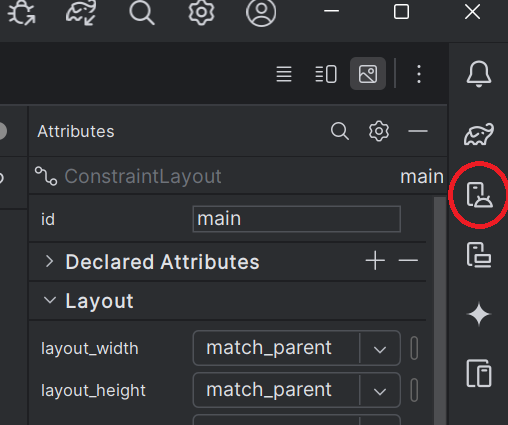

# Debugging and Testing

Android Studio provides tools which allow developers to load applications directly from loaded projects.  This allows you to step through the code, add breakpoints, or additional logging without needing to create a releasable APK package.

## Options

_Using a Device_

In order to connect to the device __Developer Mode__ needs to be enabled which allows for USB connection and debugging.

1. Navigate to your device Settings menu
2. Find About Device
3. Locate the Build number and click it 7 times
    * NOTE: The location of the build number and number of clicks may vary between devices; you may need to look up the device instructions
4. You will receive notice that developer mode has been unlocked
5. Navigate back one menu to System to access the new Developer options menu
6. Turn on USB debugging
7. With Android Studio open attach via USB cable an Android device to your computer
8. On your device press **OK** to allow USB debugging
9. Run the application by clicking Run → Run 'app'
    * Ensure your device is selected and click **OK**

_Using an Emulator_

Android Studio comes equipped with built-in device emulators and options for emulating real world devices for testing the applications you develop, to ensure functionality is as you expect it across a range of device types.

1. Select the Device Manager option from the icons on the right side of the editor view as shown below.

    * Alternately you can also select Tools -> Device Manager from the file menu.

2. Click on the __+__ button and select the __Create Virtual Device__ button
3. Create the type of virtual device you would like to use
    * You may also need to download the appropriate API runtime level
4. Ensure your emulated device is selected and click **OK**
5. Locate the Run menu along the File menu bar along the top of Android Studio and click Run ‘app’
    * You might need to click Stop first
    * You can also run the emulator by clicking the familiar green Play button along the icon toolbar

NOTE:
* These can be managed using the Android Virtual Machine (AVD) Manager at any time

_Using Android x86 Lab OS_

The lab computers do not have an Android Emulator installed by default.  They can be accessed through another virtual machine.

1. Launch Android Studio VM 
2. Launch Android OS VM
3. In the launch Android studio VM open a terminal
4. Enter the command 'adb connect 10.0.2.4:5555'
    * The terminal should respond with 'connected to 10.0.2.4:5555'
    * Android studio should now be able to find the emulated device. 

NOTE:
* This VM is slower than an Android Emulator but does allow us to simulate things like low battery state and receiving a text message, which this VM doesn't
* It does, however, let us run apps and test some basic functionality
